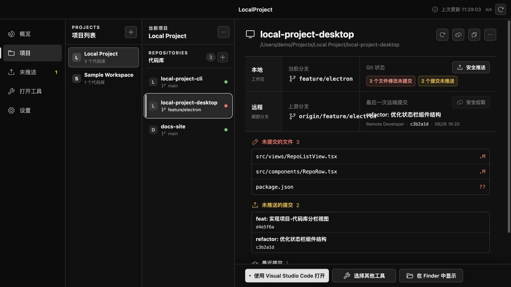

# LocalProject

一个面向 macOS 的轻量本地项目管理工具。仓库同时提供 npm CLI 和 Electron Desktop，它们使用同一份 JSON 注册表组织项目与代码库，集中查看 Git 状态、安全拉取或推送提交，并用可扩展的 opener 打开编辑器、IDE、终端或其他工具。

- CLI：npm 包 `local-project-cli`，安装后使用 `project` 命令。
- Desktop：桌面应用 `LocalProject`，公开 Electron + Vue 源码和本机构建脚本。
- 两者可以单独安装，不会互相覆盖，只共享 `~/.local-project-cli/registry.json`。



## 环境要求

- macOS
- Node.js 20 或更高版本
- Git（仅 Git 状态、获取、拉取和推送功能需要）

## 安装

从 npm 全局安装：

```bash
npm install -g local-project-cli
```

首次执行会自动创建 `~/.local-project-cli/registry.json`：

```bash
project
```

也可以先执行非交互命令：

```bash
project list
```

注册表路径优先级为：`--registry` > `LOCAL_PROJECT_CLI_REGISTRY` > `~/.local-project-cli/registry.json`。

## 快速开始

无参数运行会进入交互界面：

```bash
project
```

交互界面的“设置 → 管理打开工具”可以新增、编辑、设为默认或删除 opener。启动方式分为三种：

- “macOS 应用”是 `open -a` 的快捷模板，只需填写应用名称或 `.app` 完整路径。
- “后台命令”允许完整设置 `command` 和 `args`，适合不需要终端交互的启动器。
- “终端命令”会在 Terminal 中运行 `command + args`，适合 Codex CLI 等交互式程序。

选择后台或终端命令时，需要输入参数 JSON 数组。

也可以直接使用子命令：

```bash
project add project "示例项目"
project add repo /path/to/backend --project "示例项目" --name backend
project add . --project "示例项目" --name current-repo

project list
project inspect "示例项目/backend"
project pending
project open "示例项目/backend"
```

非 Git 目录也可以登记，状态会显示为“未初始化 Git”。

## Opener 管理

Opener 由稳定的 `id`、展示名称、可执行命令和参数数组组成。参数中的 `{path}` 会替换成代码库路径或该代码库单独配置的 `openTarget`。

查看 opener：

```bash
project opener list
project opener get vscode
project opener get vscode --json
```

### 三种启动方式示例

下面三个常用工具分别对应三种启动方式。可以在“设置 → 管理打开工具 → `add`”中按表格填写，也可以直接复制对应的 CLI 命令。

#### macOS 应用：ChatGPT Desktop

适合已经安装为 `.app`、并且能够接收文件夹路径的桌面应用。

| 填写项 | 值 |
| --- | --- |
| id | `chatgpt` |
| 显示名称 | `ChatGPT Desktop` |
| 启动方式 | `macOS 应用` |
| 应用名称或路径 | `/Applications/ChatGPT.app` |

```bash
project opener add \
  --id chatgpt \
  --name "ChatGPT Desktop" \
  --command open \
  --arg -a \
  --arg "/Applications/ChatGPT.app" \
  --arg "{path}"
```

#### 后台命令：Visual Studio Code CLI

适合能接收路径、启动后不需要继续占用交互终端的命令。使用前需要在 VS Code 命令面板执行 `Shell Command: Install 'code' command in PATH`。

| 填写项 | 值 |
| --- | --- |
| id | `vscode-cli` |
| 显示名称 | `Visual Studio Code CLI` |
| 启动方式 | `后台命令` |
| 可执行命令 | `code` |
| 参数 | `["{path}"]` |

```bash
project opener add \
  --id vscode-cli \
  --name "Visual Studio Code CLI" \
  --command code \
  --arg "{path}"
```

#### 终端命令：Codex CLI

[Codex CLI](https://learn.chatgpt.com/codex/cli) 是交互式终端程序，需要在 Terminal 中持续运行，因此使用“终端命令”。

| 填写项 | 值 |
| --- | --- |
| id | `codex-cli` |
| 显示名称 | `Codex CLI` |
| 启动方式 | `终端命令` |
| 可执行命令 | `codex` |
| 参数 | `["-C", "{path}"]` |

```bash
project opener add \
  --id codex-cli \
  --name "Codex CLI" \
  --command codex \
  --arg -C \
  --arg "{path}" \
  --mode terminal
```

更新、设置默认值和删除：

```bash
project opener update vscode-cli --name "VS Code CLI"
project opener update vscode-cli --arg=--wait --arg "{path}"
project opener default vscode-cli
project opener remove vscode-cli
```

`mode` 默认为 `background`，交互式 CLI 应设置为 `terminal`。当参数值本身以 `--` 开头时，请使用 `--arg=<值>`。默认 opener 或仍被代码库引用的 opener 不能直接删除，需要先切换默认值或让相关代码库改用其他工具。

为某个代码库临时选择 opener：

```bash
project open "示例项目/backend" --with vscode-cli
```

通过 `--with` 或交互菜单临时选择其他工具只影响本次打开，不会修改代码库默认工具。代码库默认工具需要显式配置；未配置时跟随全局默认。

## Git 状态与安全推送

```bash
project pending
project pending --fetch
project push "示例项目/backend" --dry-run
project push "示例项目/backend"
project push --all --dry-run
project push --all
```

安全边界：

- 不自动 commit，也不提供 force push。
- 批量推送前展示计划并要求确认。
- 无 upstream、落后远端、分支分叉、detached HEAD 或正在 merge/rebase 的代码库不会批量推送。
- 删除项目、代码库或 opener 只修改注册表，不删除磁盘上的项目文件。
- opener 命令直接通过进程参数执行，不经过 shell；但注册表仍属于本机可执行配置，只应使用可信配置。

## 更新和卸载

```bash
npm update -g local-project-cli
npm uninstall -g local-project-cli
```

卸载程序不会删除 `~/.local-project-cli/registry.json`。如需彻底清理，请自行备份后删除该目录。

## Desktop 桌面端

LocalProject 提供项目、代码库、Git 状态、安全推送/拉取和 opener 管理界面。它不注册或覆盖全局 `project` 命令，只与 CLI 共享兼容的 `~/.local-project-cli/registry.json`。

仓库只公开 macOS Desktop 源码，不提供官方 Desktop 二进制 Release 或自动更新服务。可以在 `desktop/` 中直接运行开发版，也可以为自己的 Mac 生成本机安装包；具体命令见 [Desktop 源码运行与本机打包](docs/desktop-build.md)。

## 隐私与网络边界

- 项目、代码库和 opener 配置只保存在本机注册表中，不上传到 LocalProject 服务。
- 项目扫描只读取已登记目录的本地 Git 状态，不包含遥测或使用行为上报。
- 只有用户主动执行获取远端状态、安全拉取或安全推送时，Git 才会访问代码库配置的远端。
- opener 是本机可执行配置；只应添加自己安装或确认可信的应用与命令。

## 从源码开发

CLI 位于仓库根目录，使用 npm 和 `package-lock.json`：

```bash
git clone https://github.com/reader0421/local-project-cli.git
cd local-project-cli
npm ci
npm run check
npm test
npm link
project
```

Desktop 位于 `desktop/`，使用 pnpm 和独立的 `desktop/pnpm-lock.yaml`：

```bash
cd desktop
corepack enable
pnpm install --frozen-lockfile
pnpm test
pnpm build
pnpm dev
```

检查发布包内容：

```bash
npm pack --dry-run
```

CLI 当前没有运行时第三方依赖，也不需要转译或构建步骤；`npm pack` 生成的 tarball 就是 CLI 发布产物。Desktop 使用 Vue、Electron 和 electron-vite，只公开源码和本机构建脚本。

注册表完整格式见 [docs/registry-format.md](docs/registry-format.md)，版本变化见 [CHANGELOG.md](CHANGELOG.md)，参与开发见 [CONTRIBUTING.md](CONTRIBUTING.md)，安全问题请参考 [SECURITY.md](SECURITY.md)。

## License

[MIT](LICENSE)
